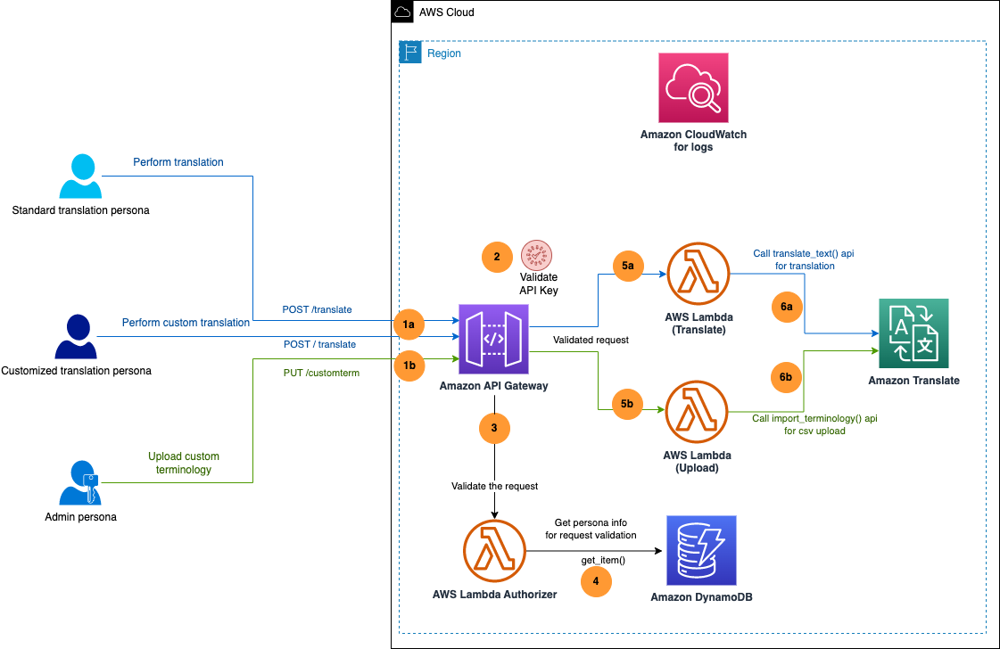
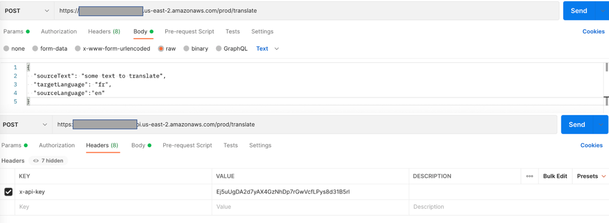
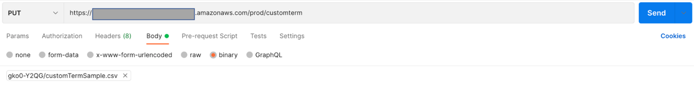
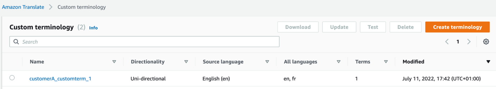

## Enterprise Translation - A foundational use case for customizing Amazon Translate

This post provides an example of how to build a centralized customizable translation solution using Amazon Translate, Amazon API Gateway, AWS Lambda and Amazon DynamoDB. For details about the use-case, please refer to the [blog post](https://aws.amazon.com/blogs/machine-learning/a-foundational-use-case-for-customizing-amazon-translate/).

The solution uses the native features of Amazon Translate, including real-time translation, automatic source language detection (powered by [Amazon Comprehend](https://aws.amazon.com/comprehend/)), and custom translation using [custom terminology](https://docs.aws.amazon.com/translate/latest/dg/how-custom-terminology.html). You can expose these features as one simple <i>/translate</i> API using API Gateway. In order for custom terminology to work, you also need to upload the terminology files to Amazon Translate. Therefore, the API <i>/customterm</i> is exposed to do that.

The solution illustrates two options for translation: a standard translation and a customized translation (using the custom terminology feature). However, you can modify these options as needed to suit your business requirements. Consumers can use these options using [API keys](https://docs.aws.amazon.com/apigateway/latest/developerguide/api-gateway-api-usage-plans.html) of API Gateway. When a translation request is received by the API, it validates (using an [AWS Lambda](http://aws.amazon.com/lambda) authorizer function) whether the provided API key is authorized to perform the type of translation requested. We use an [Amazon DynamoDB](https://aws.amazon.com/dynamodb/) table to store metadata information about consumers, permissions, and API keys.

Three consumer types are defined as part of the solution deployment:

<b>Standard translation persona</b> – Uses the standard translation option, allowing text translation, including automatic language detection.

<b>Customized translation persona</b> – Uses the customized translation option, allowing all features of standard translation and also custom translations using a custom terminology file.

<b>Admin persona</b> – Supports the customized translation option, allowing the upload of a custom terminology file, but isn’t able to make any other translation API calls.

The following diagram illustrates the solution architecture.

  

<h4>For the user translation persona, the process includes the following actions (the blue path in the preceding diagram):</h4>

1a/ The user calls the <i>/translate</i> API and passes the API key in the API header. Optionally, for the customized translation persona, the user can enable custom translation by passing in an optional query string parameter (<i>useCustomTerm</i>).

2/ API Gateway validates the API key.

3/ The Lambda custom authorizer is called to validate the action that the supplied API key is allowed. For instance, a standard translation persona can’t ask for custom translation, or an administrator can’t perform any text translation.

4/ The Lambda authorizer gets the user information from the DynamoDB table and verifies against the API key provided.

5a/ After validation, another Lambda function (Translate) is invoked to call the Amazon Translate API <i>translate_text</i>.

6a/ The translated text is returned in the API response.

<h4>The admin persona can upload a custom terminology file that can be used by the customized translation persona by calling the <i>/customterm API</i>. The workflow steps are follows (the green path in the preceding diagram):</h4>

1b/ The user calls the <i>/customterm</i> API and passes the API key in the API header.

2/ API Gateway validates the API key.

3/ The Lambda custom authorizer is called to validate the action that the supplied API key is allowed. For instance, only an admin persona can upload custom terminology files.

4/ The Lambda authorizer gets the user information from the DynamoDB table and verifies against the API key provided.

5b/ After the API key is validated, another Lambda function (Upload) is invoked to call the Amazon Translate API <i>import_terminology</i>.

6b/ The custom terminology file is uploaded to Amazon Translate with a unique name generated by the Lambda function.

<h3>Deploy the solution with AWS CloudFormation</h3>

Launch the provided CloudFormation template (<i>aws-enterprise-translate.yaml</i>) to deploy the solution in your AWS account. It can be deployed in any AWS region where Amazon Translate is supported.

<i>Note that you are responsible for the cost of the AWS services used while running this sample deployment. Many of these services (such as Amazon Translate, API Gateway, and Lambda) come with a Free Tier to get you started. For full details, see the pricing pages for each AWS service that you use in this post.</i>

1/ Open CloudFormation page in console and select <b>Create stack with new resources</b>.

2/ Provide the location of CloudFormation template from this repo (either stored locally or in your AWS S3 Bucket).

3/ Choose <b>Next</b>.

4/ For <b>Stack name</b>, enter the name of the CloudFormation stack (for this post, EnterpriseTranslate).

5/ For <b>DDBTableName</b>¸ enter the name of the DynamoDB table (<i>EnterpriseTranslateTable</i>).

6/ For <b>apiGatewayName</b>, enter the API Gateway created by the stack (<i>EnterpriseTranslateAPI</i>).

7/ For <b>apiGatewayStageName</b>, enter the environment name for API Gateway (<i>prod</i>).

8/ Choose <b>Next</b>.

9/ On the review page, select the check boxes to acknowledge the creation of IAM resources.This is required to allow CloudFormation to create a role to grant access to the resources needed by the stack and name the resources in a dynamic way.

10/ Choose <b>Create stack</b>.

The deployment creates the following resources (all prefixed with <i>EntTranslate</i>):

- An API Gateway API with two resources called <i>/customterm</i> and <i>/translate</i>, with three API keys to represent two translation personas and an admin persona.

- A DynamoDB table with three items to reflect one consumer with three different roles (three API keys).

- Several Lambda functions (using Python 3.9) as per the architecture diagram.

After the resources are deployed into your account on the AWS Cloud, you can test the solution.

<h3>Testing the solution</h3>

<h4>Collect API keys</h4>

Complete the following steps to collect the API keys:

- Navigate to the <b>Outputs</b> tab of the CloudFormation stack and copy the value of the key <i>apiGatewayInvokeURL</i>.To find the API keys created by the solution, look in the DynamoDB table you just created or navigate to the API keys page on the API Gateway console. This post uses the latter approach.

- On the <b>Resources</b> tab of the CloudFormation stack, find the logical ID <i>EntTranslateApi</i> for API Gateway and open the link under the <b>Physical ID</b> column in a new tab.

- On the API Gateway console, choose <b>API Keys</b> in the navigation pane.

- Note the three API keys (standard, customized, admin) generated by the solution. For example, select standard key <i>EntTranslateCus1StandardTierKey</i> and choose <b>Show link</b> against the API key property.

Now you can test the APIs using any open-source tools of your choosing. For this post, we use the [Postman](https://www.postman.com/) API testing tool for illustration purposes only. For details on testing API with Postman, refer to [API development overview](https://learning.postman.com/docs/designing-and-developing-your-api/the-api-workflow/).

<h4>Test 1: Standard translation</h4>

To test the standard translation API, you first create a POST request in Postman.

- Choose <b>Add Request</b> in Postman.

- Set the method type as <b>POST</b>.

- Enter the API Gateway invoke URL.

- Add <i>/translate</i> to the URL endpoint.

- On the <b>Headers</b> tab, add a new header key named <i>x-api-key</i>.

- Enter the standard API key value.

- On the <b>Body</b> tab, select <b>Raw</b> and enter a JSON body as follows:

{
            "sourceText": "some text to translate",
            "targetLanguage": "fr",
            "sourceLanguage":"en"
}

<i>sourceLanguage</i> is an optional parameter. If you don’t provide it, the system will set it as auto for the automatic detection of the source language.

- Call the API by choosing <b>Send</b> and verify the output.

  

The API should run successfully and return the translated text in the <b>Body</b> section of the response object.

<h4>Test 2: Customized translation with custom terminology</h4>

To test the custom term upload functionality, we first create a PUT request in Postman.

- Choose <b>Add Request</b> in Postman.

- Set the method type as <b>PUT</b>.

- Enter the API Gateway invoke URL.

- Add <i>/customterm</i> to the end of the URL.

- On the <b>Headers</b> tab, add a new header key named x-api-key.

- Enter the admin API key value (copied from API Gateway).

- On the Body tab, change the format to <b>binary</b> and upload the custom term CSV file.A sample CSV file is provided under the <i>/Resources</i> folder.

- Call the API by choosing <b>Send</b> and verify the output.

  

The API should run successfully with a message in the Body section of the response object saying “<i>Custom term uploaded successfully</i>”.

- On the Amazon Translate console, choose <b>Custom Terminology</b> in the navigation pane.
A custom terminology file should have been uploaded and is displayed in the terminology list. The file name syntax is the customer ID from the DynamoDB table for the selected API key followed by string <i>_customterm_1</i>.

  

Note that if you didn’t use the admin API key, the system will fail to upload the custom term file.Now you’re ready to perform your custom translation.

- Choose <b>Add Request</b> in Postman.

- Set the method type as <b>POST</b>.

- Enter the API Gateway invoke URL.

- Add <i>/translate</i> to the URL endpoint.

- On the <b>Headers</b> tab, add a new header key named <i>x-api-key</i>.

- Enter the standard API key value.

- On the Body tab, enter a JSON body as follows:

{
            "sourceText": "some text to translate",
            "targetLanguage": "fr",
            "sourceLanguage":"en"
}

- On the <b>Params</b> tab, add a new query string parameter named <i>useCustomTerm</i> with a value of <b>1</b>.

- Call the API by choosing <b>Send</b> and verify the output.The API should fail with the message “Unauthorized.” This is because you’re trying to call a customized translation feature using a standard persona API key.

- On the <b>Headers</b> tab, enter the customized API key value (copied from API Gateway).

- Run the test again, and it should be able to translate using the custom terminology file.

You will also notice that this time the translated text keeps the word “translate” without translating it (if you used the sample file provided). This is due to the fact that the custom terminology file that was previously uploaded has the word “translate” in it, suggesting that the custom terminology modified the base output from Amazon Translate.

<h4>Test 3: Add additional consumers and tenants</h4>

This solution deployed one consumer (<i>customerA</i>) with three different API keys as part of the CloudFormation stack deployment. You can add additional consumers by creating a new usage plan in API Gateway and associating new API keys to this usage plan. For more details on how to create usage plans and API keys, refer to [Creating and using usage plans with API keys](https://docs.aws.amazon.com/apigateway/latest/developerguide/api-gateway-api-usage-plans.html). You can then add these API keys as additional entries in the DynamoDB table.

<h3>Clean up</h3>

To avoid incurring future charges, clean up the resources you created as part of the CloudFormation stack:

- On the AWS CloudFormation console, navigate to the stack you created.

- Select the stack and choose <b>Delete</b> stack.

Your stack might take some time to be deleted. You can track its progress on the Events tab. When the deletion is complete, the stack status changes from <i>DELETE_IN_PROGRESS</i> to <i>DELETE_COMPLETE</i>. It then disappears from the list.

## Security

See [CONTRIBUTING](CONTRIBUTING.md#security-issue-notifications) for more information.

## License

This library is licensed under the MIT-0 License. See the LICENSE file.

